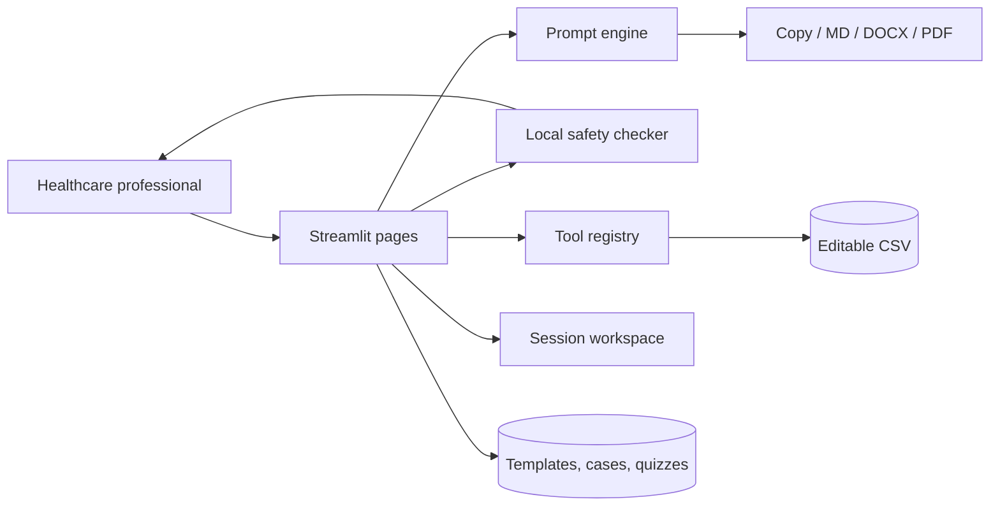

# Architecture

```mermaid
flowchart LR
U[Healthcare professional] --> UI[Streamlit pages]
UI --> PE[Prompt engine]
UI --> SC[Local safety checker]
UI --> TR[Tool registry]
UI --> WS[Session workspace]
PE --> EX[Copy / MD / DOCX / PDF]
TR --> CSV[(Editable CSV)]
UI --> JSON[(Templates, cases, quizzes)]
SC --> U
```

No external API is required. Optional future connectors must use explicit consent, approved providers and secure secrets.
