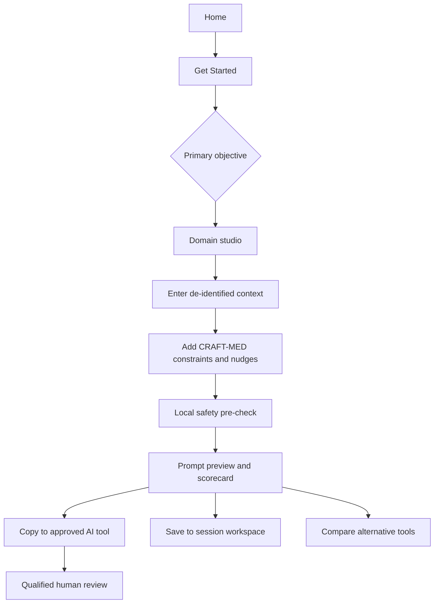

# User Flow

```mermaid
flowchart TD
A[Home] --> B[Get Started]
B --> C{Primary objective}
C --> D[Domain studio]
D --> E[Enter de-identified context]
E --> F[Add CRAFT-MED constraints and nudges]
F --> G[Local safety pre-check]
G --> H[Prompt preview and scorecard]
H --> I[Copy to approved AI tool]
H --> J[Save to session workspace]
H --> K[Compare alternative tools]
I --> L[Qualified human review]
```
